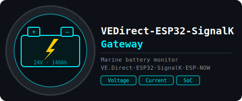
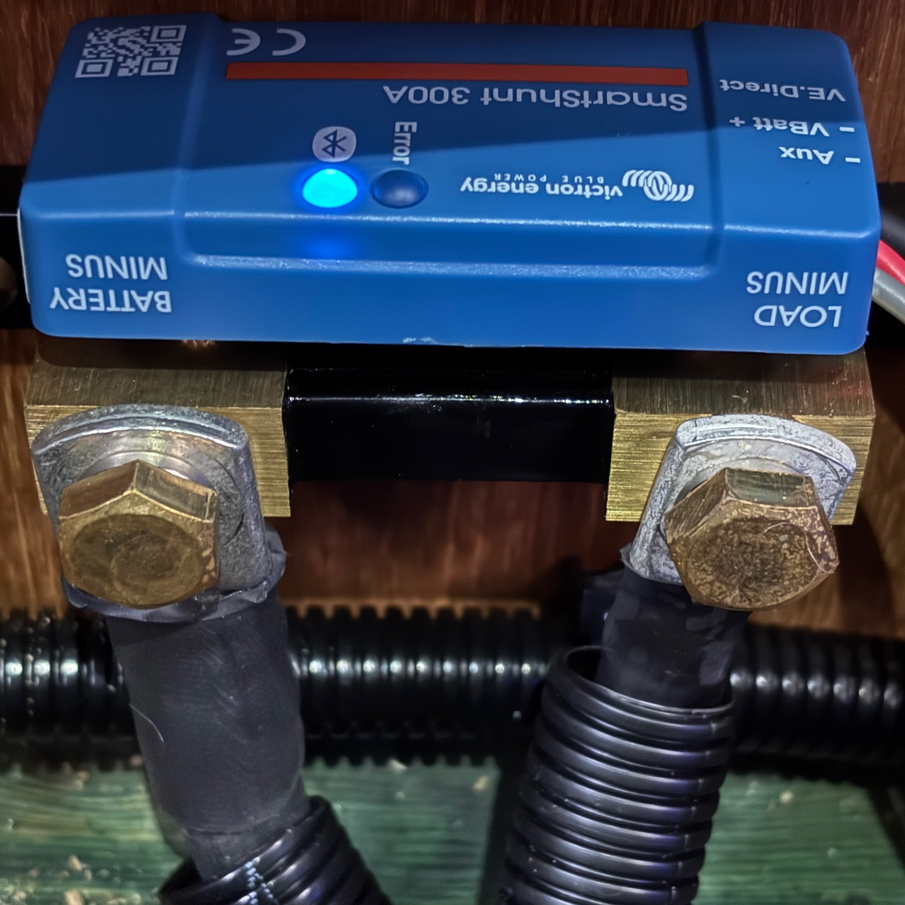
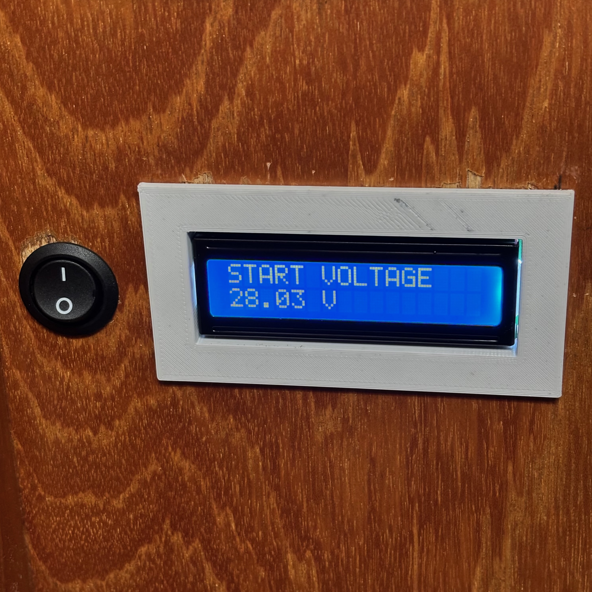
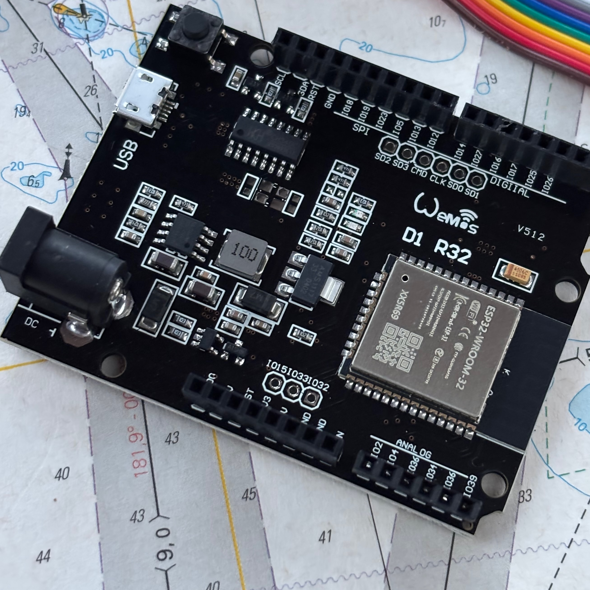
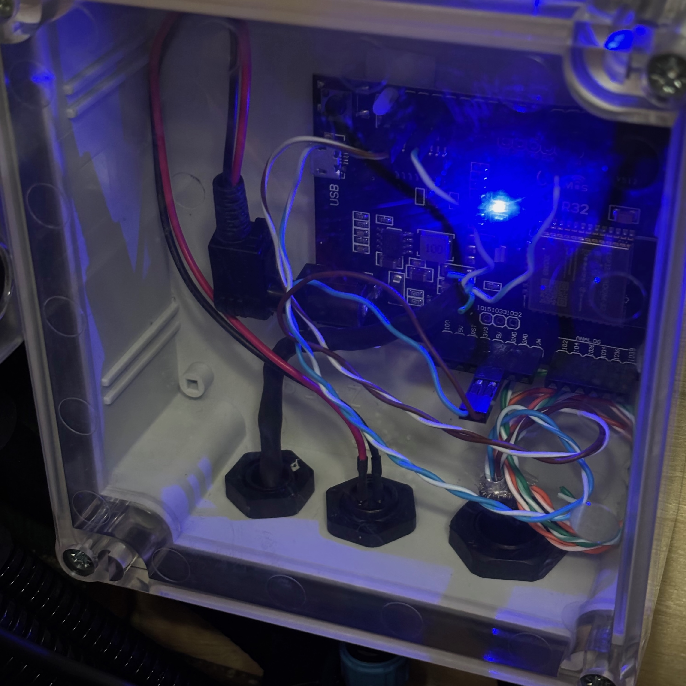

# VEDirect-ESP32-SignalK Gateway

[](https://www.espressif.com/en/sdks/esp-arduino)
[](https://www.victronenergy.com/battery-monitors/smart-battery-shunt)
[](https://signalk.org)
[](https://github.com/gilmaimon/ArduinoWebsockets)
[](https://www.espressif.com/en/solutions/low-power-solutions/esp-now)
[](LICENSE)

ESP32-based gateway that reads battery data from a [Victron SmartShunt](https://www.victronenergy.com/battery-monitors/smart-battery-shunt) via the VE.Direct text protocol and forwards it to a [SignalK](https://signalk.org) server via WebSocket/JSON and to other ESP32 devices via ESP-NOW.

Reads five values from the SmartShunt: house battery voltage, current and power, state of charge, and starter battery voltage. Converts raw VE.Direct integers to SI units (V, A, W, SoC as percent) and sends all five values in a single SignalK delta every second.

Uses LCD 16x2 to show battery status, performance diagnostics and network connection info. If no Wi-Fi is available, ESP-NOW broadcast continues and the LCD shows battery data.

OTA updates enabled. Persistent configuration storage (NVS) and web UI reserved for future implementations.

Developed and tested on:
- [Wemos D1 R32 ESP32 development board](https://partco.fi/tuote/arduino-esp32-kehityskortti-esp-wroom-32-2526)
- [ESP32 board package](https://github.com/espressif/arduino-esp32) (3.3.7)
- [Arduino IDE](https://www.arduino.cc/en/software/) (2.3.8)
- SignalK Server (2.23.0)
- Victron SmartShunt (300 A)

Integrated via ESP-NOW to:
- [ESP32-Crowpanel-compass multi-function display](https://github.com/mkvesala/ESP32-Crowpanel-compass) v2.1.0

## Purpose of the project

This is one of my individual digital boat projects. Use at your own risk. Not for safety-critical operations.

1. I wanted a cost-effective way to get Victron battery monitor data wirelessly into SignalK without the official Victron dongle
2. I needed ESP-NOW output so a standalone display can show battery status without depending on the SignalK network being up
3. The project started as a single-file Arduino sketch and was later refactored into the class-based architecture I have used in my other "gateway" projects

## Release history

| Release | Branch | Comment |
|---------|--------|---------|
| v1.0.0 | main | First versioned and latest release. Full refactor into class-based architecture. ESP-NOW added. |

## Classes

Class diagram including the companion projects:


### VEDSensor

Encapsulates VE.Direct serial communication. Runs a FreeRTOS reader task pinned to Core 0 that continuously reads the UART stream and populates an internal cache protected by `portMUX_TYPE` spinlock. The main loop reads a consistent snapshot via `getSnapshot()` without blocking.

| Method | Returns | Comment |
|--------|---------|---------|
| `begin()` | `void` | Configures UART2 (RX GPIO16, 19200 baud) and starts reader task. |
| `getSnapshot(Snapshot &out)` | `void` | Thread-safe atomic copy of the current cache. |

`VEDSensor::Snapshot` fields: `mv`, `ma`, `w`, `soc`, `vs` (raw int32) and matching millisecond timestamps `ts_mv` … `ts_vs`.

### VEDProcessor

Consumes a `VEDSensor::Snapshot`, converts raw VE.Direct integers to SI units, and populates the shared `ESPNow::BatteryDelta` struct. A value is set to `NaN` if its timestamp is older than 30 seconds.

| Method | Returns | Comment |
|--------|---------|---------|
| `update()` | `void` | Reads snapshot, converts, updates delta and getters |
| `getDelta()` | `ESPNow::BatteryDelta` | All five SI values for brokers |
| `getHouseVoltage()` | `float` | House bank volts (V) |
| `getHouseCurrent()` | `float` | House bank amps (A) |
| `getHousePower()` | `float` | House bank watts (W) |
| `getHouseSoc()` | `float` | House bank state of charge (% 0.0–100.0) |
| `getStartVoltage()` | `float` | Starter battery volts (V) |
| `hasValidData()` | `bool` | True if at least one value is not NaN |

### Other classes

**`SignalKBroker`:**
- Owns: `WebsocketsClient`
- Uses: `VEDProcessor`
- Owned by: `VEDApplication`
- Responsible for: WebSocket connection to SignalK server, building and sending a single JSON delta containing all five battery values every ~1 s

**`ESPNowBroker`:**
- Uses: `VEDProcessor`
- Owned by: `VEDApplication`
- Responsible for: ESP-NOW broadcast of `ESPNowPacket<BatteryDelta>` every ~1 s using the shared `espnow_protocol.h` packet format

**`DisplayManager`:**
- Owns: two `LiquidCrystal_I2C` instances (addresses 0x27 and 0x3F), selected by I2C scan on boot
- Uses: `VEDProcessor`, `SignalKBroker`
- Owned by: `VEDApplication`
- Responsible for: LCD display of battery data, diagnostics and status messages

**`VEDPreferences`:**
- Uses: `VEDProcessor`
- Owned by: `VEDApplication`
- Responsible for: NVS configuration storage — *skeleton, not yet implemented*

**`WebUIManager`:**
- Uses: `VEDProcessor`, `VEDPreferences`, `SignalKBroker`, `DisplayManager`
- Owned by: `VEDApplication`
- Responsible for: HTTP configuration UI — *skeleton, not yet implemented*

**`VEDApplication`:**
- Owns: all subsystems as stack-allocated members
- Uses: `WifiState`
- Responsible for: orchestrating all subsystems, running the Wi-Fi state machine and timed loop handlers

**`WifiState`:**
- Global enum class for Wi-Fi connection states (INIT / CONNECTING / CONNECTED / FAILED / DISCONNECTED / OFF) just to lessen the amount of calls to WiFi library and to keep WiFi dependency only in `VEDApplication`

## Features

### VE.Direct reading

1. Reads the continuous VE.Direct text stream on UART2 (RX GPIO16, 19200 baud, SERIAL_8N1)
2. Reader runs in a dedicated FreeRTOS task on Core 0 at priority 2, independent of the main loop
3. Parsed label→value pairs are cached with millisecond timestamps; five labels tracked: `V`, `I`, `P`, `SOC`, `VS`
4. Cache access is protected by `portMUX_TYPE` spinlock's critical section; main loop reads via atomic `getSnapshot()`
5. Values older than 30 seconds are treated as stale and reported as `NaN`
6. Raw integers converted to SI units in `VEDProcessor`: mV→V, mA→A, Victron SoC tenths-of-percent→percent (0.0–100.0)

### SignalK communication

Connects to:
```
ws://<server>:<port>/signalk/v1/stream?token=<optional>
```

**Sends** at ~1 s interval, all five values in a single delta message:

1. `electrical.batteries.house.voltage` (V)
2. `electrical.batteries.house.current` (A)
3. `electrical.batteries.house.power` (W)
4. `electrical.batteries.house.capacity.stateOfCharge` (0.0-1.0)
5. `electrical.batteries.start.voltage` (V)

Values that are `NaN` (stale or not yet received) are silently omitted from the delta. If all five are `NaN` the delta is not sent.

WebSocket reconnection uses exponential backoff starting at ~2 s, doubling on each failed attempt up to a maximum of ~120 s. On successful reconnect the backoff resets to ~2 s.

Wi-Fi connection is attempted for ~90 s on boot. If it times out or fails, the device continues running with ESP-NOW only; SignalK and OTA are unavailable until the next reboot.

**Please refer to Security section of this file.**

### ESP-NOW communication

Broadcasts battery data via ESP-NOW protocol for other ESP32 devices such as external displays. Operates independently of Wi-Fi — broadcast continues even if SignalK connection is lost.

All ESP-NOW messages use the shared `ESPNow::ESPNowPacket` wrapper (`ESPNowHeader` + typed payload) defined in `espnow_protocol.h`.

**Sends** at ~1 s interval:
- `ESPNow::ESPNowPacket<BatteryDelta>` — payload `BatteryDelta` containing:
  - `house_voltage` (V)
  - `house_current` (A)
  - `house_power` (W)
  - `house_soc` (% 0.0–100.0)
  - `start_voltage` (V)

**Broadcast mode:** Uses broadcast address (FF:FF:FF:FF:FF:FF) — any ESP-NOW receiver on the same Wi-Fi channel can listen.

**WiFi coexistence:** ESP-NOW operates alongside Wi-Fi (`WIFI_AP_STA` mode). Both SignalK WebSocket and ESP-NOW broadcast function simultaneously.

**Note: ESP-NOW receivers must be on the same Wi-Fi channel as this device. The simplest approach is to connect both devices to the same Wi-Fi network with a fixed channel.**

### LCD 16x2

1. Shows house voltage, starter voltage, house current and state of charge in a compact two-line layout:
   ```
    26.54V  26.71V
    -3.20A  87.5%
   ```
2. Shows status messages during boot (Wi-Fi connecting, IP address, signal level) and periodically during operation (Wi-Fi signal level, WebSocket open/closed)
3. Shows diagnostic messages on the way (free heap mem, stack high watermark for reader task and main loop)
4. LCD content refreshes only when it has changed, to avoid unnecessary blinking
5. Supports both I2C addresses 0x27 and 0x3F — detected automatically on boot
6. If no LCD is detected the device operates normally without display output

Using a different display can be done within `DisplayManager` while keeping its public API intact.

## Project structure

| File(s) | Description |
|---------|-------------|
| `VEDirect-ESP32-SignalK-gateway.ino` | Owns `VEDApplication app`, contains `setup()` and `loop()` |
| `secrets.example.h` | Example credentials. Rename to `secrets.h` and populate with your credentials |
| `version.h` | Software version constant |
| `helpers.h` | Global helper functions |
| `espnow_protocol.h` | Shared ESP-NOW protocol definitions (header, payload structs, packet wrapper) |
| `WifiState.h` | Enum class for Wi-Fi states |
| `VEDSensor.h / .cpp` | Class `VEDSensor` — VE.Direct UART reader, FreeRTOS task, thread-safe cache |
| `VEDProcessor.h / .cpp` | Class `VEDProcessor` — unit conversion and `BatteryDelta` assembly |
| `VEDPreferences.h / .cpp` | Class `VEDPreferences` — NVS storage skeleton |
| `SignalKBroker.h / .cpp` | Class `SignalKBroker` — WebSocket connection and delta sender |
| `ESPNowBroker.h / .cpp` | Class `ESPNowBroker` — ESP-NOW broadcast sender |
| `DisplayManager.h / .cpp` | Class `DisplayManager` — LCD 16x2 I2C control |
| `WebUIManager.h / .cpp` | Class `WebUIManager` — HTTP web UI skeleton |
| `VEDApplication.h / .cpp` | Class `VEDApplication` — application orchestrator |

## Hardware

### Bill of materials

1. Wemos D1 R32 ESP32 Dev Module
2. Victron SmartShunt — connected via VE.Direct to UART2 RX (GPIO16)
   - VE.Direct cable: 3.3 V TTL serial, RX only (no TX needed)
   - Baud rate: 19200, 8N1
3. LCD 16x2 module with I2C backpack, SDA=GPIO21, SCL=GPIO22
   - I2C address 0x27 or 0x3F detected automatically
4. Wi-Fi router providing wireless LAN AP with a fixed channel
5. 3D printed [panel mount bezel](https://www.printables.com/model/158413-panel-mount-16x2-lcd-bezel) for LCD 16x2
6. Wiring, DC power jack, enclosure
7. MacOS device running SignalK server in LAN
8. Crowpanel 2.1" HMI rotary display running Crowpanel-ESP32-compass firmware

**Wiring summary:**

| Signal | ESP32 pin | Notes |
|--------|-----------|-------|
| VE.Direct RX | GPIO16 (UART2 RX) | 3.3 V TTL — check SmartShunt VE.Direct port voltage |
| LCD SDA | GPIO21 | Pull-up via LCD backpack |
| LCD SCL | GPIO22 | Pull-up via LCD backpack |

**Note: Victron SmartShunt versions use both 3.3 V and 5 V TTL levels at VE.Direct port — ALWAYS measure the level before connecting to ESP32 board and use logic level shifter if needed! **

**No paid partnerships.**

## Software used

1. Arduino IDE 2.3.7
2. Espressif Systems esp32 board package 3.3.7
3. Additional libraries installed via Library Manager:
   - ArduinoWebsockets by Gil Maimon (0.5.4)
   - ArduinoJson by Benoit Blanchon (7.4.3)
   - LiquidCrystal_I2C by Frank de Brabander (1.1.2)
   - ArduinoOTA (included in ESP32 board package)
4. Crowpanel-ESP32-compass firmware (v2.1.0)
5. SignalK server (2.23.0)

## Installation

1. Clone the repo
   ```
   git clone https://github.com/mkvesala/VEDirect-ESP32-SignalK-gateway.git
   ```
2. Alternatively, download the code as a zip
3. Set up your credentials in `secrets.h` (first by renaming `secrets.example.h` to `secrets.h`)
   ```cpp
   inline constexpr const char* WIFI_SSID = "your_wifi_ssid_here";
   inline constexpr const char* WIFI_PASS = "your_wifi_password_here";
   inline constexpr const char* SK_HOST   = "your_signalk_address_here";
   inline constexpr uint16_t    SK_PORT   = 3000; // or whatever your port is
   inline constexpr const char* SK_TOKEN  = "your_token_here";
   inline constexpr const char* OTA_PASS  = "your_ota_password_here";
   inline constexpr const char* DEFAULT_WEB_PASSWORD  = "your_default_web_password_here";
   ```
4. **Make sure that `secrets.h` is listed in your `.gitignore` file**
5. Connect the SmartShunt VE.Direct TX to GPIO16 (RX) and optionally an LCD to the I2C pins
6. Connect and power up the ESP32 via USB
7. Compile and upload with Arduino IDE (board package and required libraries installed)
8. Open Serial Monitor at 115200 baud to verify the device is reading VE.Direct data and connecting to Wi-Fi
9. Verify battery values appear in the SignalK server data browser

**Please refer to Security section of this file.**

## Todo

Check [issues](https://github.com/mkvesala/VEDirect-ESP32-SignalK-gateway/issues).

## Security

### Maritime navigation

**Use at your own risk — not for safety-critical operations!**

### Current state

In v1.0.0 the web UI is not yet implemented — there are no HTTP endpoints exposed. The device only opens an outbound WebSocket connection to the SignalK server and sends ESP-NOW broadcasts.

### SignalK token

If your SignalK server requires authentication, provide the token in `secrets.h`. The token is transmitted in the WebSocket URL in plaintext over the local network.

### Important security considerations

1. **No HTTPS**
   - WebSocket connection transmits data in plaintext
   - Use only on private, trusted networks

2. **LAN deployment only**
   - Do NOT expose the device to the public internet
   - Keep the ESP32 on an isolated boat Wi-Fi network
   - Use WPA2/WPA3 encryption

3. **`secrets.h`**
   - Make sure that `secrets.h` is listed in your `.gitignore` file
   - Never commit credentials to version control

### Deployment

**Recommended:**
- Deploy on a private isolated boat Wi-Fi
- Use WPA2/WPA3 Wi-Fi encryption

**Not recommended:**
- Public internet exposure
- Port forwarding to the ESP32

## Credits

Software and libraries used are described in the above sections.

Inspired by [VictronVEDirectArduino](https://github.com/winginitau/VictronVEDirectArduino) library.

This project started as a single-file `.ino` sketch and was refactored into the class-based architecture, which also serves as the architectural reference for [CMPS14-ESP32-SignalK-gateway](https://github.com/mkvesala/CMPS14-ESP32-SignalK-gateway) and [BME280-ESP32-SignalK-gateway](https://github.com/mkvesala/BME280-ESP32-SignalK-gateway). This is a companion project also to the [ESP32-Crowpanel-compass](https://github.com/mkvesala/ESP32-Crowpanel-compass). See below diagram how the projects relate:


No paid partnerships.

Developed by Matti Vesala in collaboration with Claude Code. See [CONTRIBUTING](CONTRIBUTING.md) for guidelines on AI assisted development.

I would appreciate improvement suggestions as well as any Arduino-style ESP32/C++ coding advice.

## Gallery

    
